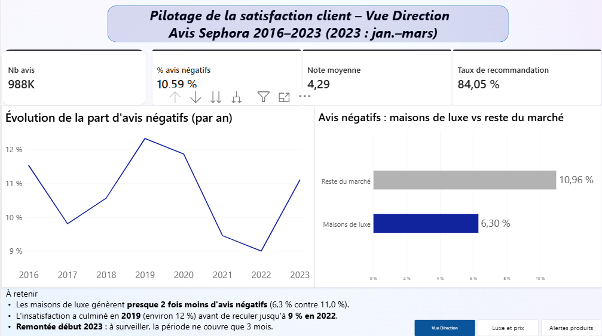
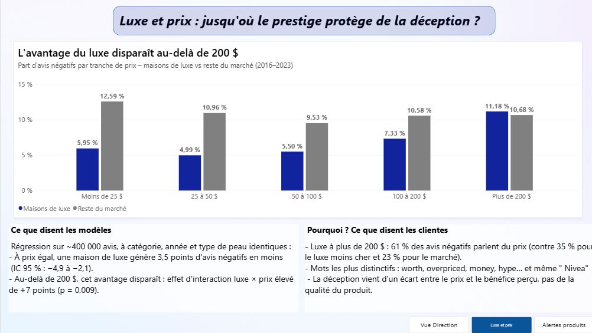
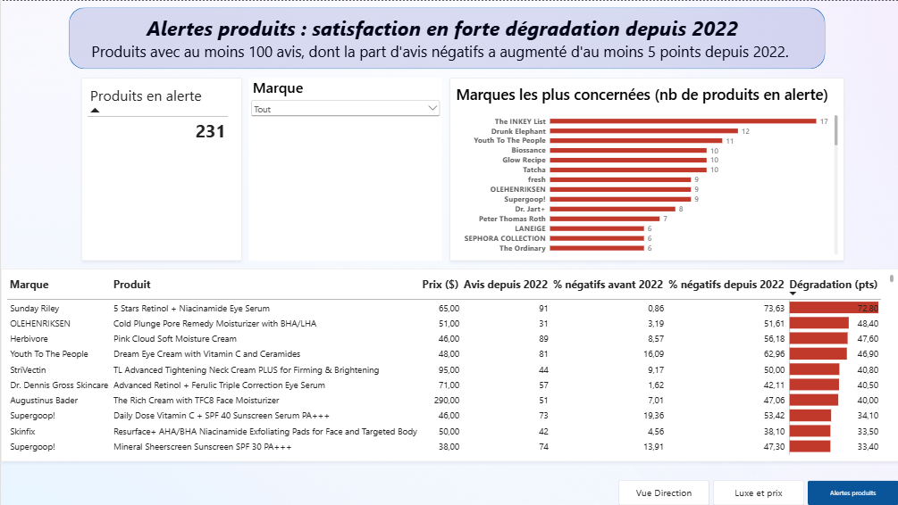

# Satisfaction client dans la beauté de luxe : le prestige protège-t-il de la déception ?

**SQL · Python (pandas, statsmodels) · Économétrie · Analyse de texte · Power BI** — Projet personnel, 2026

Pilotage de la satisfaction client à partir de **près de 1,1 million d'avis Sephora** (soins de la peau, 2008–2023) : base SQL, contrôle qualité, KPI, modélisation « toutes choses égales par ailleurs », analyse du texte des avis et dashboard Power BI de pilotage.

---

## Questions business

1. Les maisons de luxe (Dior, Lancôme, Guerlain, La Mer…) déçoivent-elles moins leurs clientes que le reste du marché ?
2. Cet avantage tient-il **à prix égal**, et jusqu'à quel niveau de prix ?
3. **Pourquoi** les clientes sont-elles déçues ?
4. Quels produits faut-il surveiller en priorité ?

## Résultats clés

| | Constat | Chiffre |
|---|---|---|
| 1 | **Le luxe déçoit presque deux fois moins** | 6,3 % d'avis négatifs (1–2★) contre 11,0 % pour le reste du marché (2016–2023) |
| 2 | **L'avantage tient à prix égal** | −3,5 points d'avis négatifs, IC 95 % [−4,9 ; −2,1], effets fixes catégorie / année / type de peau |
| 3 | **…mais disparaît au-delà de 200 $** | 11,2 % d'avis négatifs pour le luxe > 200 $ ; interaction luxe × prix élevé : +7 points (p = 0,009) |
| 4 | **Au-delà de 200 $, on reproche le prix, pas le produit** | 61 % des avis négatifs évoquent le prix (contre 35 % pour le luxe moins cher et 23 % pour le marché) ; pas plus de plaintes d'efficacité ou d'irritation |
| 5 | **Un biais de mesure important** | 14,5 % des avis portent sur des produits reçus gratuitement, avec 8 à 14 points d'avis négatifs en moins |
| 6 | **231 produits en alerte** | Hausse d'au moins 5 points de la part d'avis négatifs depuis 2022 (ex. : sérum yeux passé de 0,9 % à 73,6 %) |

## Recommandations

1. **Produits ultra-premium (> 200 $) : justifier le prix** plutôt que changer la formule — explication des actifs, échantillons avant achat, diagnostic de peau, suivi après achat.
2. **Piloter la satisfaction sur les avis spontanés**, en excluant les avis de produits offerts qui gonflent les indicateurs.
3. **Mettre en place une revue hebdomadaire des alertes produits** (dashboard page 3) pour détecter rapidement une reformulation ratée ou un problème qualité.

---

## Démarche

| Étape | Fichier | Contenu |
|---|---|---|
| 1. Base de données | `01_chargement.py` | Chargement de 1,09 M d'avis et 8 494 produits dans **SQLite** ; pseudonymisation des identifiants clientes |
| 2. Qualité des données | `02_qualite.py` | 11 contrôles (doublons, dates, notes hors échelle, incohérences note / recommandation, cohérence du référentiel marques…) avec une décision documentée pour chacun ; segment de prix calculé **dans chaque catégorie** |
| 3. KPI et SQL | `03_kpi.sql`, `03_kpi.py` | **Dictionnaire de 10 KPI** (définition, formule, source, seuil d'alerte) ; 6 vues SQL de pilotage (fonctions de fenêtre `LAG` pour l'évolution N/N-1, CTE, `UNION ALL`) ; exports pour Power BI |
| 4. Modélisation | `04_modeles.py` | Modèles de probabilité linéaire avec effets fixes et erreurs robustes regroupées par produit ; interactions ; contrôle du biais « produit offert » ; robustesse par régression logistique (effets marginaux) |
| 5. Analyse du texte | `05_texte.py` | 10 thèmes détectés par mots-clés (méthode transparente) ; tests du khi-deux ; mots distinctifs par log-odds ; lien entre alertes et reformulation |
| 6. Dashboard | `dashboard_sephora.pbix` | **Power BI** en 3 pages : Vue Direction, Luxe et prix, Alertes produits (mesures DAX pondérées, filtres, segment par marque, mise en forme conditionnelle) |

## Points de rigueur

- **Corrélation vs causalité** : les écarts bruts sont systématiquement vérifiés « toutes choses égales par ailleurs ». Exemple : les exclusivités Sephora semblaient plus critiquées, mais l'effet disparaît une fois la catégorie et le prix contrôlés.
- **Moyennes pondérées** : tous les KPI agrégés sont pondérés par le nombre d'avis.
- **Période fiable** : analyses temporelles à partir de 2016 (volumes suffisants) ; 2023 ne couvre que janvier–mars.
- **Limites** : données issues d'un seul distributeur et d'une seule catégorie (soins) ; peu de produits de luxe au-delà de 200 $ (intervalle de confiance large) ; détection des thèmes par mots-clés (vérifiée sur échantillon, mais imparfaite).

## Reproduire le projet

1. Télécharger le jeu [Sephora Products and Skincare Reviews](https://www.kaggle.com/datasets/nadyinky/sephora-products-and-skincare-reviews) (Kaggle, licence CC BY 4.0) et placer les CSV dans `data/`.
2. `pip install -r requirements.txt`
3. Lancer dans l'ordre : `python 01_chargement.py`, `02_qualite.py`, `03_kpi.py`, `04_modeles.py`, `05_texte.py`
4. Ouvrir `dashboard_sephora.pbix` dans Power BI Desktop.

*Données : Nady Inky, « Sephora Products and Skincare Reviews », Kaggle (2023), licence CC BY 4.0. Projet à visée pédagogique, sans lien avec Sephora ni LVMH.*

---
**Nermin Assal** — Étudiante en M1 CMI Data Science, Université Paris Nanterre
